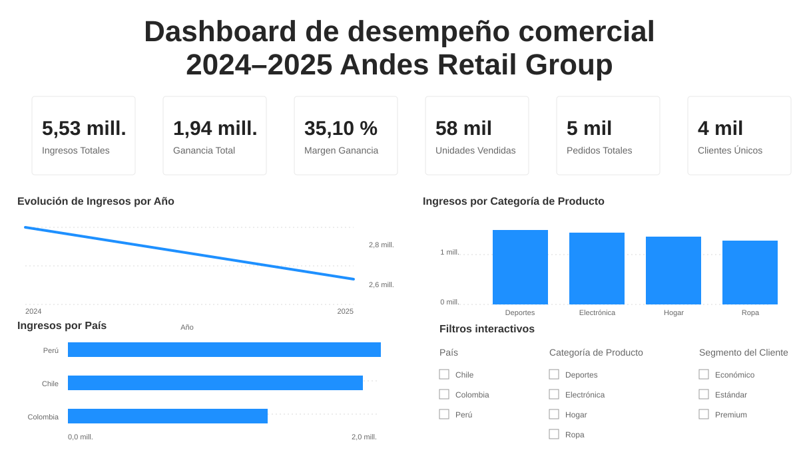
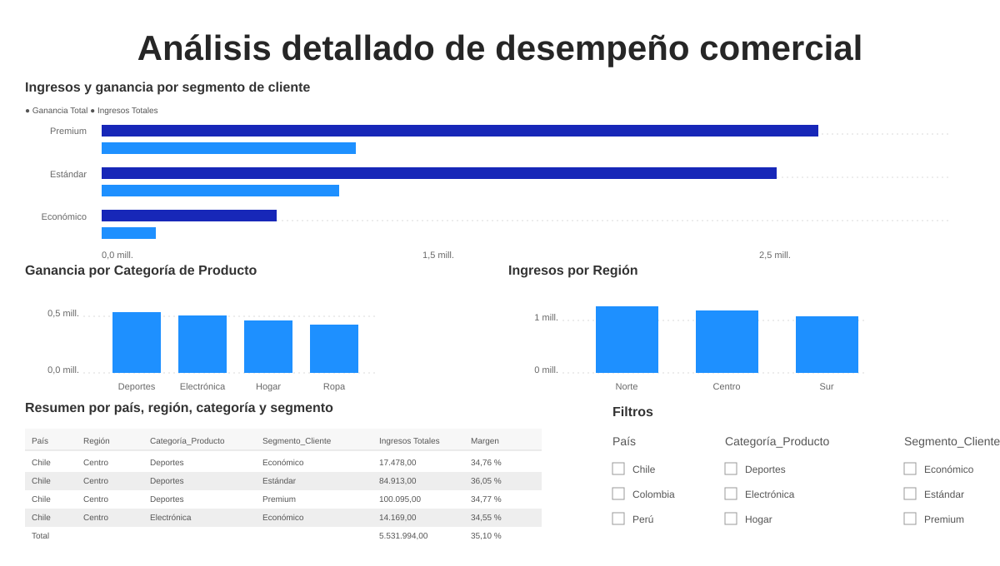

# Andes Retail Commercial Performance Analysis

Power BI dashboard project focused on commercial performance, revenue behavior, profitability, customer segments, product categories, geographic performance, and executive business interpretation for Andes Retail Group during 2024-2025.

This project is part of my professional data analytics portfolio and is positioned as a Business Intelligence / Marketing Data Analytics case study.

## Project Overview

This project analyzes the commercial performance of Andes Retail Group using a transactional Excel dataset and a Power BI dashboard.

The goal was to transform raw commercial data into an executive dashboard that helps monitor revenue, profit, margin, units sold, orders, customers, product categories, countries, regions, and customer segments.

The final dashboard includes two main views:

1. **Executive Overview**
2. **Detailed Analysis**

The project follows a complete business intelligence workflow:

```text
Excel dataset -> Power Query -> Power BI -> KPI modeling -> dashboard design -> business insights -> recommendations
```

## Business Context

Andes Retail Group operates across Colombia, Chile, and Peru, selling products across four main categories:

- Electronics
- Clothing
- Sports
- Home

The business needed a clear way to evaluate commercial performance during 2024 and 2025, identify where revenue and profit were concentrated, and detect opportunities by customer segment, product category, country, and region.

From a business perspective, this dashboard helps answer questions such as:

- How did total revenue evolve between 2024 and 2025?
- Which countries and regions generated the most revenue?
- Which product categories contributed most to profit?
- Which customer segments generated the highest commercial value?
- Where could Andes Retail Group focus future commercial actions?

## Dataset Used

The analysis uses a transactional Excel dataset containing commercial order data for 2024 and 2025.

Main fields include:

- Order ID
- Order date
- Season
- Customer ID
- Customer segment
- Region
- Country
- Product category
- Units sold
- Unit price
- Revenue
- Cost

The dataset was prepared in Power Query before building the dashboard in Power BI.

## Data Preparation

The data preparation process included:

- Importing the Excel dataset into Power BI
- Reviewing the structure of the table and the available business fields
- Converting order dates into date format
- Setting units sold as whole numbers
- Setting unit price, revenue, and cost as numeric fields
- Keeping categorical fields such as country, region, customer segment, season, and product category as text
- Creating a conditional column called `Nivel_Venta` to classify orders based on revenue level
- Validating that the dataset was ready for KPI calculation and dashboard development

## Key Metrics

The dashboard tracks the following key performance indicators:

| Metric | Result |
|---|---:|
| Total Revenue | 5.53M |
| Total Profit | 1.94M |
| Profit Margin | 35.10% |
| Units Sold | 58K |
| Total Orders | 5K |
| Unique Customers | 4K |

These metrics provide an executive view of the business performance and support deeper analysis by segment, category, country, and region.

## Power BI Dashboard

### Executive Overview

The executive view summarizes the main business indicators: total revenue, total profit, profit margin, units sold, total orders, and unique customers. It also shows annual revenue evolution, revenue by product category, revenue by country, and interactive filters for country, category, and customer segment.

<p align="center">
  
</p>

### Detailed Analysis

The detailed view explores revenue and profit by customer segment, profit by product category, revenue by region, and a summary table by country, region, product category, and customer segment. This page supports deeper commercial diagnosis and opportunity detection.

<p align="center">
  
</p>

## Dashboard Pages

### 1. Executive Overview

The Executive Overview page is designed for quick business reading.

It includes:

- KPI cards for revenue, profit, margin, units sold, orders, and customers
- Annual revenue evolution between 2024 and 2025
- Revenue by product category
- Revenue by country
- Interactive filters for country, product category, and customer segment

This view helps stakeholders quickly understand the general commercial performance of Andes Retail Group.

### 2. Detailed Analysis

The Detailed Analysis page provides a deeper diagnostic view.

It includes:

- Revenue and profit by customer segment
- Profit by product category
- Revenue by region
- Summary table by country, region, product category, and customer segment
- Interactive filters for business exploration

This view helps identify which segments, categories, and regions explain the main revenue and profit patterns.

## Key Findings

Some of the main findings from the dashboard include:

1. **Revenue decreased between 2024 and 2025.**  
   The annual revenue trend shows a decline, which suggests the need to monitor commercial performance and review growth opportunities.

2. **The Premium segment generated the highest business value.**  
   Premium customers contributed the most to both revenue and profit, followed by the Standard segment.

3. **The Economic segment had a lower contribution.**  
   This segment may require a differentiated commercial strategy depending on the company's goals for acquisition, retention, or profitability.

4. **Sports and Electronics showed strong profit performance.**  
   These categories stood out as relevant contributors to profitability.

5. **Regional performance was relatively balanced, with the North region leading revenue.**  
   North generated the highest revenue, while Center and South remained close, suggesting that regional performance should continue to be monitored.

6. **The detailed summary table supports more specific opportunity detection.**  
   Combining country, region, product category, and customer segment helps identify more precise commercial patterns.

## Business Recommendations

Based on the analysis, Andes Retail Group could consider the following actions:

1. **Monitor the revenue decline between 2024 and 2025.**  
   The company should review whether the decrease is linked to demand, seasonality, product mix, pricing, campaign performance, or regional execution.

2. **Prioritize commercial actions for the Premium segment.**  
   Since Premium customers generate the highest revenue and profit, this segment should be considered for retention, loyalty, and upselling strategies.

3. **Strengthen high-performing categories such as Sports and Electronics.**  
   These categories can be used as strategic levers for campaigns, inventory planning, and commercial focus.

4. **Use regional monitoring to adjust sales and marketing efforts.**  
   Regional differences can help guide localized campaigns and commercial resource allocation.

5. **Review the Economic segment separately.**  
   Its lower contribution does not necessarily mean it should be ignored, but it may require different pricing, messaging, or product strategies.

## Analytical Workflow

The project followed this workflow:

1. Import the Excel dataset into Power BI
2. Prepare and validate the data in Power Query
3. Create business metrics and KPI cards
4. Build an executive dashboard view
5. Build a detailed diagnostic view
6. Add filters and interactions
7. Interpret the results using business logic
8. Translate findings into recommendations

## Tools Used

- Microsoft Excel
- Power Query
- Power BI Desktop
- Business intelligence dashboard design
- Commercial performance analysis
- SCQA storytelling framework

## Portfolio Value

This project demonstrates the ability to:

- Transform Excel-based commercial data into a Power BI dashboard
- Prepare data using Power Query
- Build and interpret business KPIs
- Analyze revenue, profit, margin, customers, orders, categories, countries, and regions
- Communicate findings through executive storytelling
- Convert dashboard results into business recommendations

This is especially relevant for roles such as:

- Data Analyst
- Business Intelligence Analyst
- Marketing Data Analyst
- Commercial Analyst
- Junior BI Developer

## Personal Voice and Learning

This project helped me connect my background in marketing and business communication with data analytics.

The most valuable learning was not only building charts, but understanding how a dashboard can guide business decisions. A metric such as revenue becomes more useful when it is connected to questions about customer segments, product categories, regions, and recommended actions.

From a portfolio perspective, this project strengthens my ability to communicate insights clearly and translate commercial data into strategic recommendations.

## Repository Structure

```text
andes-retail-commercial-performance-analysis/
├── README.md
├── andes-retail-commercial-performance-project-notebook.ipynb
├── andes-retail-commercial-performance-powerbi-dashboard.pbix
├── andes-retail-group-2024-2025-dataset.xlsx
└── images/
    ├── 1_overview-ejecutivo.svg
    └── 2_analisis-detallado.svg
```

## Project Files

- `andes-retail-commercial-performance-project-notebook.ipynb`  
  Project notebook with documentation, SCQA narrative, evaluator feedback, and business interpretation.

- `andes-retail-commercial-performance-powerbi-dashboard.pbix`  
  Power BI dashboard file.

- `andes-retail-group-2024-2025-dataset.xlsx`  
  Source dataset used for the analysis.

- `images/`  
  Dashboard previews displayed directly in this README for portfolio presentation.

## Status

Portfolio polish in progress on the `portfolio-polish` branch.

Current focus:

- Keep README documentation clear and recruiter-friendly
- Display dashboard previews directly in the README
- Keep the repository structure clear
- Prepare the project for GitHub, LinkedIn, Career Accelerator, and job interviews
